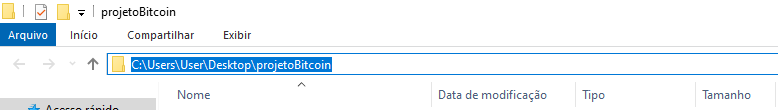
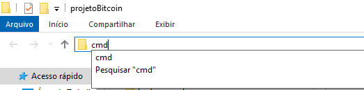
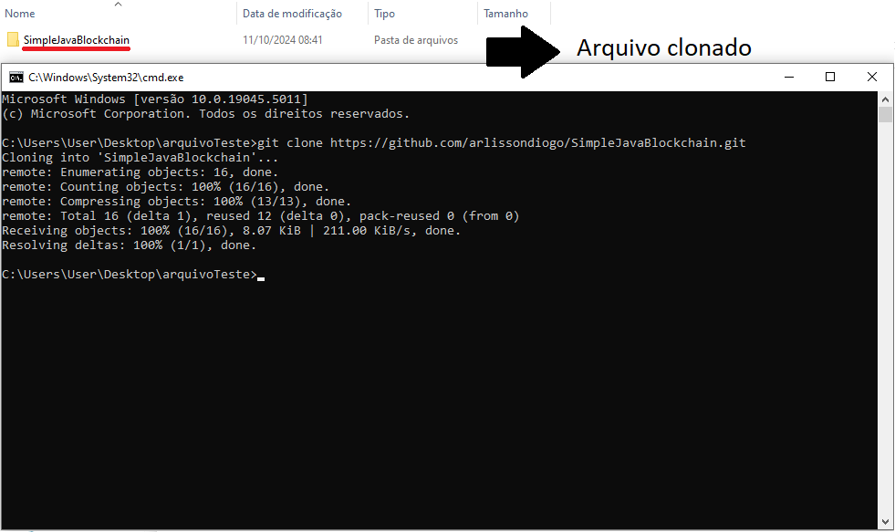

<h1 align="center"> 📜 Documentação do Projeto de Blockchain em Java </h1>

# Índice
- [Índice](#índice)
  - [Introdução](#introdução)
  - [🛠️ Pré-requisitos](#️-pré-requisitos)
  - [🛠️ baixando o arquivo do github](#️-baixando-o-arquivo-do-github)
    - [Alternativa: Clonando o repositório inteiro](#alternativa-clonando-o-repositório-inteiro)
  - [🧩 Alguns conceitos importantes](#-alguns-conceitos-importantes)
  - [Estrutura do Código](#estrutura-do-código)
    - [1. Transacao 💸](#1-transacao-)
    - [2. Bloco 🧱](#2-bloco-)
    - [3. Blockchain 🔗](#3-blockchain-)
    - [4. Main 🖥️](#4-main-️)
    - [5. Gera Endereços 📍](#5-gera-endereços)
    - [6. Validador ✅](#6-validador)
  - [🚀 Como Executar](#-como-executar)
  - [Executando o código em outras IDE](#executando-o-código-em-outras-ide)
    - [**Visual Studio Code** 💻](#visual-studio-code-)
    - [**IntelliJ IDEA** 🧩](#intellij-idea-)
    - [**Eclipse** 🌒](#eclipse-)
  - [Detalhes Técnicos](#detalhes-técnicos)
  - [Conclusão 📚](#conclusão-)

## Introdução

<p align="center"><i> Este projeto implementa uma versão simples de blockchain em Java, com foco na criação de transações, mineração de blocos e verificação da autenticidade da cadeia. Ele permite o armazenamento e validação de transações, garantindo que os dados da blockchain sejam imutáveis e seguros. A implementação utiliza criptografia SHA-256 para a validação de cada bloco, criando uma estrutura robusta contra fraudes. O projeto foi desenvolvido com fins educativos e como parte do Programa de Bolsas da Compass UOL - Blockchain</i></p>

## 🛠️ Pré-requisitos

- A versão utilizada do windows foi a 10, versões anteriores podem ficar ultrapassadas para a instalação de algumas IDE's;

- >Os tutoriais de instalação são direcionados a *windows*, caso utilize *outro sistema operacional* é necessário procurar outros tutoriais.

- **Java Development Kit (JDK)**: Este projeto foi desenvolvido utilizando a versão Java Zulu 17.52.17-ca-jdk17.0.12-win_x64. Para compilar e executar o código, certifique-se de que esta ou uma versão compatível do JDK esteja instalada.

- **IDE**: Você pode usar qualquer IDE de sua preferência para rodar o projeto, como o [IntelliJ IDEA](https://www.youtube.com/watch?v=2D5Ww-m6auw "tutorial de instação do IntelliJ IDEA"), [Eclipse](https://www.youtube.com/watch?v=KWGIaWh71q4 "tutorial de instalação do Eclipse"), [Visual Studio Code](https://www.youtube.com/watch?v=QT-YWT1-YI4 "tutorial de instalação VS code") ou o próprio terminal com `javac` e `java` para compilar e executar o código.

- Em caso de dúvida, acesse essa seção: [Execução de código em outras IDE's](#executando-o-código-em-outras-ide).

## 🛠️ baixando o arquivo do Github

Siga os passos abaixo para baixar um arquivo do GitHub:

1. **Acesse o repositório**  
   Vá até o repositório do GitHub onde o arquivo que deseja baixar está localizado. Você pode fazer isso clicando no [link](https://github.com/arlissondiogo/SimpleJavaBlockchain) do repositório ou buscando o nome `arlissondiogo/SimpleJavaBlockchain` no [GitHub](https://github.com).

2. **Navegue até o arquivo**  
   Dentro do repositório, navegue até a pasta onde o arquivo está localizado. Isso pode ser feito clicando nas pastas e arquivos dentro do repositório.

3. **Baixe o arquivo**  
   Para baixar o arquivo diretamente, siga os passos:
   - Clique no nome do arquivo.
   - No canto superior direito da página do arquivo, clique no botão **Raw**.
   - Após a visualização do arquivo em formato bruto, clique com o botão direito do mouse e selecione **Salvar como** para baixá-lo.

### Alternativa: Clonando o repositório inteiro

Se preferir baixar o repositório inteiro, siga os passos abaixo:

1. No repositório, clique no botão **Code**.
2. Copie o link fornecido (se preferir baixar via Git) ou clique em **Download ZIP** para baixar um arquivo compactado com todo o repositório.
3. Após copiar o link, navegue até uma pasta, selecione o caminho do arquivo, escreva cmd e aperte enter.
4. Quando o cmd abrir, digite:

```bash
   git clone https://github.com/arlissondiogo/SimpleJavaBlockchain.git 
```







## 🧩 Alguns conceitos importantes

Blockchain: Estrutura de dados onde blocos de transações são encadeados em sequência, mantendo um registro imutável de todas as transações. Neste código, a classe `Blockchain` gerencia uma lista de blocos (`cadeia`) e registra todas as transações realizadas, organizadas por endereço (`historicoTransacoes`). É possível adicionar blocos, validar a cadeia e exibir o histórico de transações de cada endereço.

Bloco: Cada bloco contém uma lista de transações, o hash do bloco anterior (para estabelecer a cadeia), um hash gerado a partir dos dados e um número `nonce` para controle de dificuldade de mineração. No código, a classe `Bloco` calcula e mantém seu próprio hash, vinculando-se ao bloco anterior através do `hashAnterior`.

Hash: Um hash é uma sequência de caracteres criptograficamente única, gerada com base nos dados do bloco. No contexto do blockchain, o hash assegura a integridade dos dados, pois qualquer modificação nos dados do bloco alteraria seu hash. A classe `Bloco` usa o algoritmo SHA-256 para calcular o hash a partir do conteúdo do bloco.

Transação: Representa uma operação entre um remetente e um destinatário, onde uma certa quantia é transferida. A classe `Transacao` encapsula essas informações e inclui métodos para garantir a validade da transação. Além disso, o código inclui um sistema de validação para verificar se os endereços são válidos e se a quantia transferida é maior que zero.

Endereço: Cada transação é identificada por endereços do remetente e destinatário. No código, o `GeraEndereco` cria endereços exclusivos e válidos para identificar os participantes das transações.

Validação de Cadeia: A integridade da cadeia de blocos é verificada comparando os hashes dos blocos consecutivos, garantindo que nenhuma alteração tenha sido feita nos blocos. No código, o método `cadeiaValida` na classe `Blockchain` percorre os blocos e valida a consistência dos hashes.

## Estrutura do Código

O projeto contém as seguintes classes:

### 1. Transacao 💸

A classe Transacao modela uma transação com os atributos de remetente, destinatário e quantia.

Construtor:

```java
public Transacao(String remetente, String destinatario, long quantia): Inicializa uma nova transação com um remetente, destinatário e a quantia transferida.
```

Métodos:

```java
public String getDestinatario(): Retorna o destinatário da transação.
public String getRemetente(): Retorna o remetente da transação.
public long getQuantia(): Retorna a quantia envolvida na transação.
@Override public String toString(): Retorna uma representação textual da transação, incluindo remetente, destinatário e quantia.
```

### 2. Bloco 🧱

A classe Bloco armazena transações e calcula o hash do bloco com base nas transações e no hash anterior, garantindo a imutabilidade da cadeia.

Construtor:

```java
public Bloco(String hashAnterior, List<Transacao> dados): Inicializa um novo bloco, definindo o hash anterior e as transações contidas.
```

Métodos:

```java
private String minerarBloco(int dificuldade): Realiza a mineração do bloco, ajustando o nonce até que o hash atenda aos requisitos de dificuldade.
public String calcularHash(): Calcula e retorna o hash do bloco, baseado no hash anterior, timestamp, nonce e nas transações.
public String getHashAnterior(): Retorna o hash do bloco anterior.
public String getHash(): Retorna o hash do bloco atual.
public List<Transacao> getDados(): Retorna a lista de transações armazenadas no bloco.
```

### 3. Blockchain 🔗

A classe Blockchain é responsável por gerenciar a cadeia de blocos e verificar sua integridade.

Construtor:

```java
- public Blockchain(): Inicializa uma nova blockchain e adiciona o bloco gênese.
```

Métodos:

```java
private Bloco criarBlocoGênese(): Cria e retorna o bloco gênese com o hash anterior definido como "0".
public void adicionarBloco(List<Transacao> transacoes): Adiciona um novo bloco à cadeia com as transações fornecidas e atualiza o histórico de transações.
public boolean cadeiaValida(): Verifica a integridade da cadeia de blocos, recalculando os hashes e comparando-os com os originais. Retorna true se a cadeia for válida e false caso contrário.
public void imprimirCadeia(): Imprime os detalhes de cada bloco na cadeia, incluindo hash, hash anterior e transações.
public void exibirHistoricoTransacoes(String endereco): Exibe o histórico de transações para um endereço específico.
```

### 4. Main 🖥️

A classe Main contém o ponto de entrada do programa, onde a blockchain é inicializada, transações são adicionadas e a integridade da cadeia é verificada.

No Main, são realizadas operações como:

* Geração de endereços aleatórios
* Adição de transações válidas e tentativa de adição de transações inválidas
* Impressão da cadeia de blocos
* Verificação da validade da cadeia

### 5. Gera Endereços 📍

A classe `GeraEndereco` é responsável por gerar endereços únicos para identificar os participantes das transações.

Métodos:

```java
public static String gerarEnderecoAleatorio(): Gera um endereço aleatório único que segue um padrão específico e retorna o endereço gerado.
```

### 6. Validador ✅

A classe `Validador` realiza a validação de endereços e transações, assegurando que as informações atendam aos requisitos do sistema.
Métodos:

```java
public static boolean validarEndereco(String endereco): Verifica se o endereço segue o formato válido.
public static boolean validarTransacao(Transacao transacao): Valida se os endereços e a quantia da transação atendem aos requisitos de segurança.
```

## 🚀 Como Executar

1. **Instale o Java Zulu 17**:

   - Baixe e instale o JDK da versão Zulu 17.52.17-ca-jdk17.0.12 ou mais recente a partir do site oficial da Azul: [Azul Zulu Downloads](https://www.azul.com/downloads/#zulu "Área de download");
   - Certifique-se de que as variáveis `JAVA_HOME` e `PATH` estão apontando para o diretório correto do JDK;
   - Para evitar problemas um tutorial é sempre bem vindo, então clique nesse [link](https://www.youtube.com/watch?v=QekeJBShCy4&pp=ygUSY29tbyBiYWl4YXIgamRrIDE3 "tutorial para baixar e instalar o jdk") para saber mais.

2. **Compilação**:

Abra o terminal e navegue até o diretório do projeto onde está a pasta `src`. *Exemplo:*

```bash
cd C:\Users\User\Desktop\projetoBitcoin\projetoBitcoin
```

Compile todos os arquivos .java na pasta src/projetoBitcoin com o seguinte comando:

```bash
for %f in (src/projetoBitcoin/*.java) do javac -d bin %f
```

>Nota: Se aparecer uma mensagem de erro indicando que um arquivo não foi encontrado, verifique se você está no diretório correto e se os arquivos `.java` existem na pasta src/projetoBitcoin.

3. **Execute o projeto**:

Após a compilação bem-sucedida, execute o programa principal com o seguinte comando:

   ```bash
    java -cp bin projetoBitcoin.Main
   ```

> Dica: Verifique se o diretório `bin` foi criado corretamente após a compilação, contendo os arquivos `.class`.

## Executando o código em outras IDE

### **Visual Studio Code** 💻

1. **Instalação**:
   - Baixe e instale o [Visual Studio Code](https://code.visualstudio.com/).
   - Instale a extensão **"Java Extension Pack"** para suporte ao Java.

2. **Configurando o Projeto**:
   - Crie uma nova pasta para o projeto e copie os arquivos `.java` para essa pasta.
   - Abra o Visual Studio Code e selecione **"File" > "Open Folder..."** para abrir a pasta do projeto.

3. **Compilação e Execução**:
   - Abra o terminal integrado (`Ctrl + `).
   - Navegue até o diretório do projeto se necessário.
   - Compile todos os arquivos com:
  
    ```bash
    javac -d bin src/projetoBitcoin/*.java
    ```

   - Execute o programa principal:

    ```bash
    java -cp bin projetoBitcoin.Main
    ```

### **IntelliJ IDEA** 🧩

1. **Instalação**:
   - Baixe e instale o [IntelliJ IDEA](https://www.jetbrains.com/idea/download/).
   - Durante a instalação, escolha a opção para instalar o JDK se ainda não o tiver.

2. **Criando um Novo Projeto**:
   - Abra o IntelliJ e selecione **"New Project"**.
   - Selecione **"Java"**, configure o JDK e clique em **"Next"**.
   - Escolha **"Create project from existing sources"** e localize a pasta do projeto.

3. **Compilação e Execução**:
   - Clique com o botão direito na classe `Main` e selecione **"Run 'Main.main()'"**.
   - A saída será exibida na janela de console na parte inferior.

### **Eclipse** 🌒

1. **Instalação**:
   - Baixe e instale o [Eclipse IDE](https://www.eclipse.org/downloads/).
   - Durante a instalação, certifique-se de que o JDK está configurado corretamente.

2. **Criando um Novo Projeto**:
   - Abra o Eclipse e selecione **"File" > "New" > "Java Project"**.
   - Dê um nome ao projeto e clique em **"Finish"**.
   - Copie os arquivos `.java` para a pasta `src` do projeto.

3. **Compilação e Execução**:
   - Clique com o botão direito na classe `Main` e selecione **"Run As" > "Java Application"**.
   - A saída será exibida na janela de console na parte inferior

## Detalhes Técnicos

* Validação da Cadeia: O método `cadeiaValida` percorre a cadeia de blocos para verificar se algum bloco foi alterado, recalculando os hashes e comparando-os com os originais. Ele verifica a integridade de cada bloco em relação ao anterior, garantindo que a cadeia permaneça imutável.

* Algoritmo de Hashing: Utiliza a função `SHA-256` para gerar um hash único para cada bloco, assegurando a integridade dos dados e tornando a falsificação de blocos extremamente difícil.

* Mineração: No processo de criação de novos blocos, a função `minerarBloco` ajusta o nonce do bloco até que o hash gerado atenda a uma condição específica de dificuldade, como iniciar com uma sequência de zeros. Esse mecanismo é usado para garantir o consenso e a segurança na adição de novos blocos.

* Estrutura de Dados:

   * Cada bloco armazena uma lista de transações (`List<Transacao>`), criando um registro das operações.
   * Os blocos são encadeados através do campo `hashAnterior`, que assegura a continuidade e a imutabilidade da cadeia.
   * O histórico de transações é mantido em um `Map<String, List<Transacao>>`, que permite consultar todas as transações associadas a um determinado endereço.

* Validação e Tratamento de Erros: A classe `Validador` realiza validações de endereços e transações, assegurando que apenas transações válidas sejam registradas. Além disso, o método `adicionarBloco` implementa tratamento básico para impedir a adição de transações inválidas, lançando exceções em caso de erro.

* Exibição Detalhada: O método imprimirCadeia exibe informações sobre cada bloco, incluindo hash, hash anterior, e todas as transações associadas. O método `exibirHistoricoTransacoes` também permite visualizar o histórico de transações para endereços específicos.

* Exemplo de Uso: A classe `Main` demonstra a criação da blockchain, a adição de transações válidas e inválidas e a verificação de validade da cadeia. Ela serve como ponto de entrada para explorar o funcionamento do sistema.

## Conclusão 📚

Este projeto demonstra uma implementação de blockchain básica com criação de transações, mineração de blocos e validação da cadeia. É um exemplo útil para entender os conceitos fundamentais de como uma blockchain garante segurança, integridade e imutabilidade dos dados.